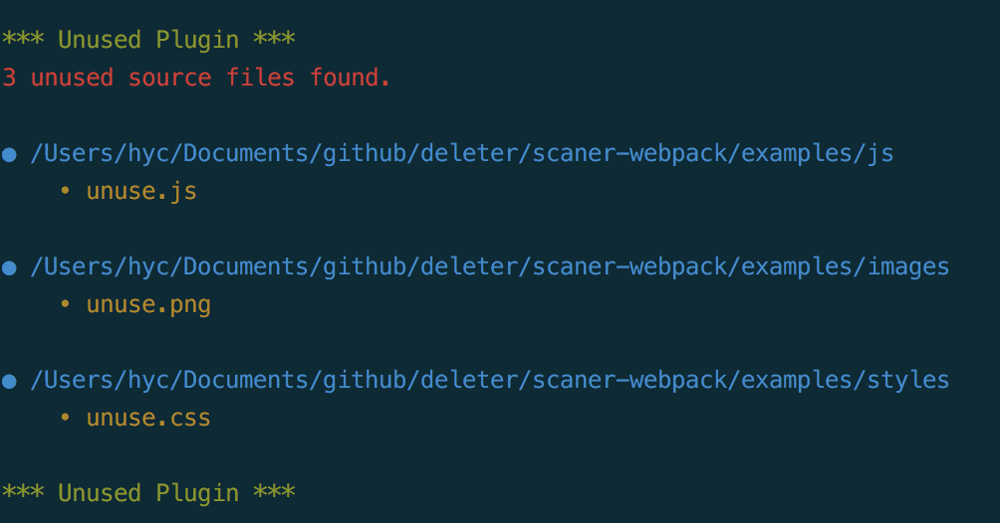
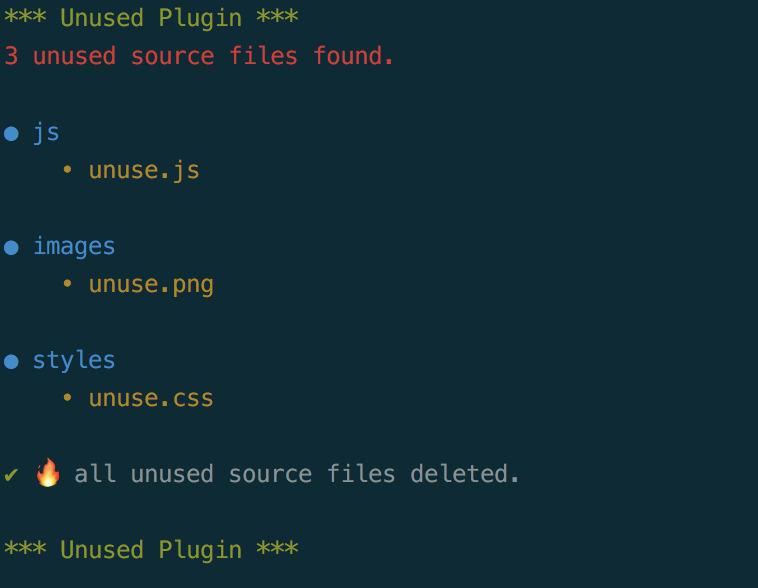

# WebpackUnusedScaner

A webpack plugin to find unused modules/source files and remove them.



## Install

```
npm i --dev webpack-unused-scaner
```

## Usage
[DEMO](https://github.com/rainpure/webpack-unused-scaner/tree/master/examples)

```javascript
// webpack.config.js

const path = require('path');
const WebpackUnusedScaner = require('webpack-unused-scaner');

module.exports = {
  // webpack configuration
  plugins: [
    ...otherPlugins,
    new WebpackUnusedScaner({
      // Source directories
      directories: [path.join(__dirname, 'src')],
      // Exclude patterns
      exclude: ['*.test.js'],
      // Root directory (optional)
      root: __dirname,
      // Remove files (optional)
      remove: false,
    }),
  ],
};
```

## Options

- `directories` : array of directories where to look for unused source files.
- `exclude` : array of exclude patterns when looking for unused source files.
- `root` : root directory that will be use to display relative paths instead of absolute ones (see below)
- `failOnUnused`: whether or not the build should fail if unused files are found (defaults to `false`)
- `useGitIgnore`: whether or not to respect `.gitignore` file (defaults to `true`)
- `remove`: whether or not to remove all unused source files (defaults to `false`)

With root


Without root



## Related
Add DELETE option for [unused-webpack-plugin](https://github.com/MatthieuLemoine/unused-webpack-plugin).
